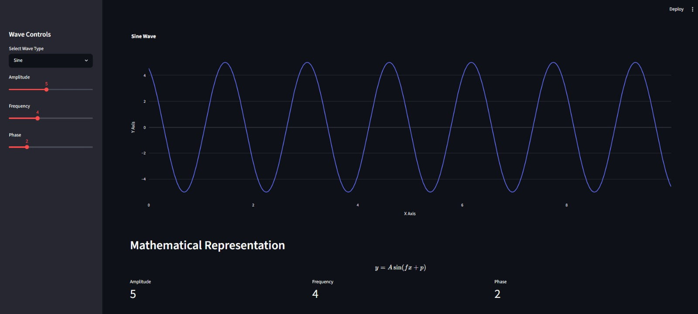

# 🚀 Physics Data Lab

Interactive physics and wave simulation dashboard built with Python and Streamlit.

## Features

- Interactive sine, cosine and tangent waves
- Adjustable amplitude, frequency and phase
- Real-time graph visualization
- Scientific dashboard interface
- Mathematical formulas rendering

## Technologies Used

- Python
- Streamlit
- NumPy
- Plotly

## Preview



## Run Locally

```bash
pip install -r requirements.txt
python -m streamlit run app.py